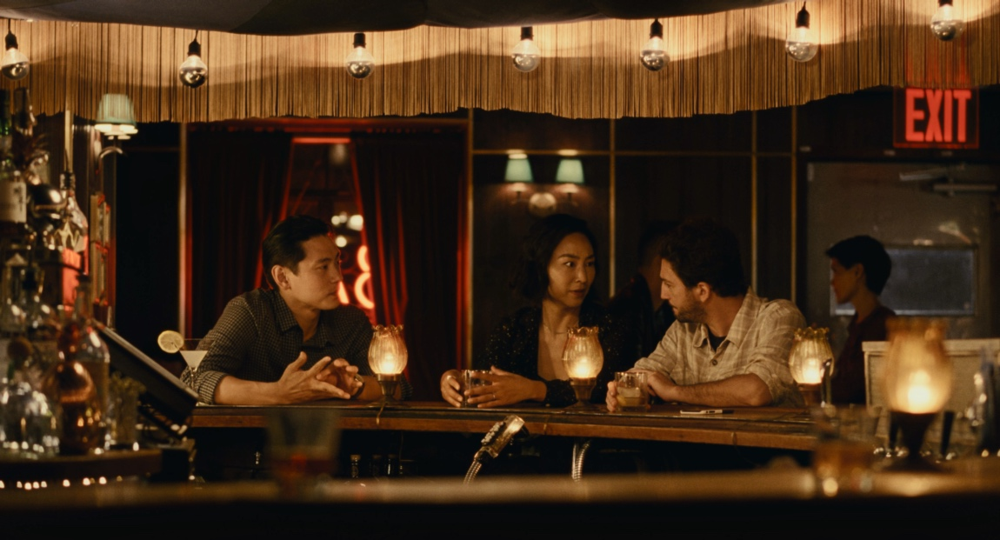
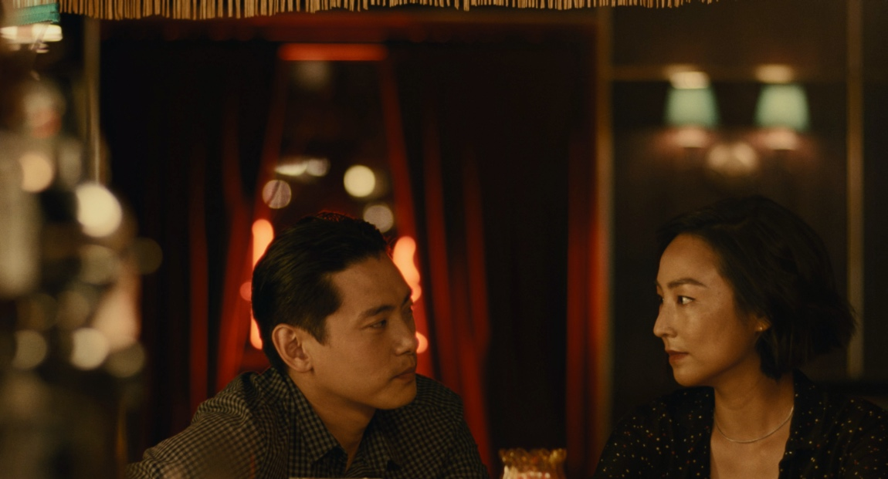
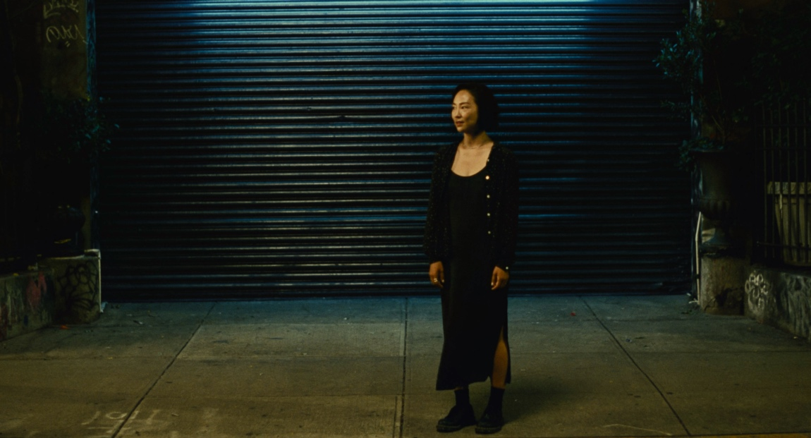
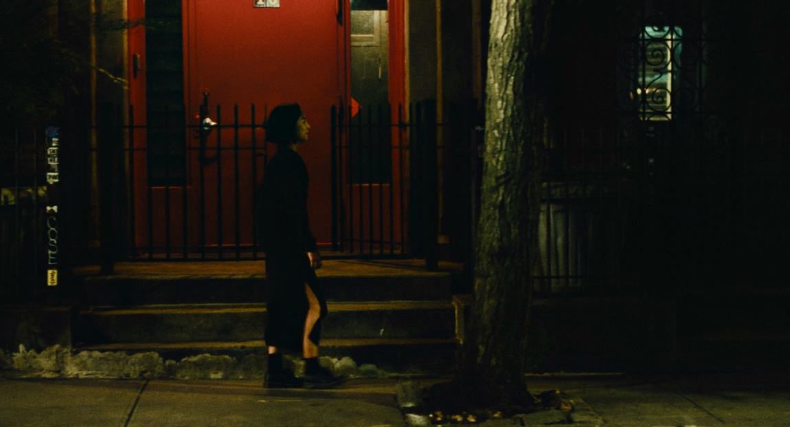

+++
date = '2026-02-10T10:04:35+01:00'
draft = false
title = 'The perfect ending of "Past Lives" (2023)'
+++

## The Bar Scene

Perhaps the biggest testament to Celine Song's masterful direction is the bar scene. The awkward setup - a "date" where both Hae Sung, her childhood friend, and Arthur, her current husband, share the same moment - is acted and directed in a way that truly captures the peculiarity of their dynamic.

The camerawork starts with all three shown in a single frame, cutting between Hae Sung and Arthur as Nora translates and navigates the difficult balance of enjoying time with her long-lost friend while reassuring her husband of her unwavering commitment. She suddenly reaches for Arthur's hand, a gesture that says "this is nothing, we're good."

As the conversation becomes more intimate, the awkwardness fades. Nora stops translating, and the camera cuts to an off-centered frame, showing that excluding Arthur from the conversation is by no means surgical - it's hasty and awkward. In that moment, Nora looks at Hae Sung as if Arthur never existed. The spell breaks when Arthur reappears in the frame, right as Nora realizes she is "bound to stay". This scene could be completely silent and carried by Nora's facial expressions alone and it would probably be as impactful.

## The Goodbye

The final scene is a farewell between Nora and Hae Sung as they wait for his Uber to the airport. After a brief conversation, they embrace, and he drives away.

As Nora walks back, she passes multiple doors before reaching the one where her husband waits at the stairs. The imagery suggests that by choosing one door, all others remain closed forever; by choosing one story, she must let go of all the others. When she finally reaches Arthur, she bursts into tears, mourning the life she will never live, the potential of what could have been if she had chosen differently.

Yet she understands the magnitude of what she built to date. As she said herself: _if you leave something behind, you gain something too._ She doesn't really know Hae Sung—only a 12-year-old version of him, a curated glimpse at 21, and now this brief idealized reunion in the present. Both of them realize they only know past mirages of each other. 

## The End

The ending is an "ending", as bittersweet as it can be it's simply a conclusion, a final closure. It's an ending to the story of Nora and Hae Sung, but also an ending to their past lives. Nora, as she burst into tears, seems to be letting go of the last childhood dream remaining - the reaction magnified by the realization that she is not only severing her ties to Hae Sung, but also finally abandoning her childhood ambitions.
