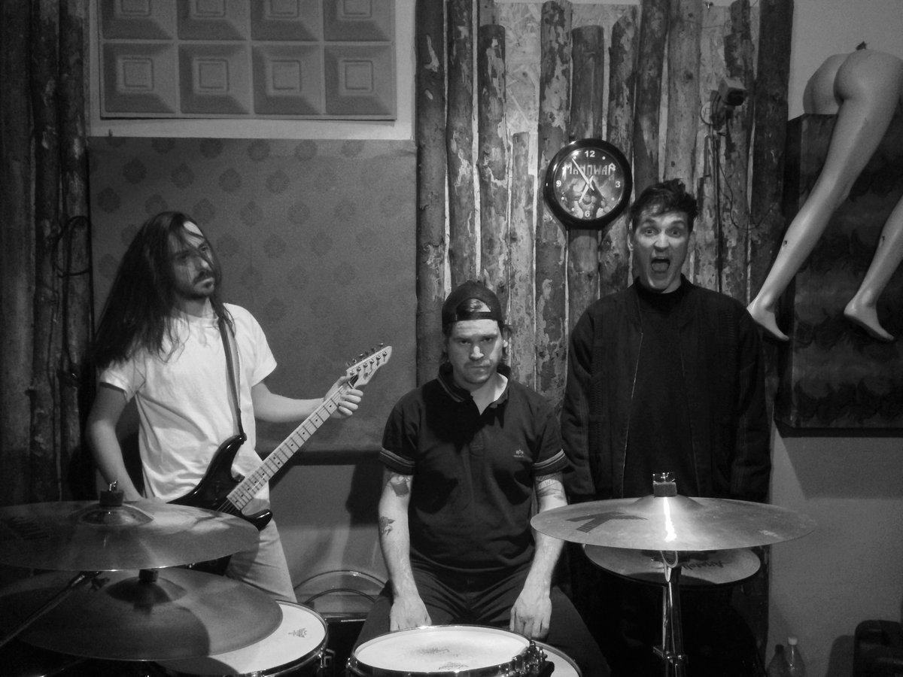

+++
date = '2026-03-03T14:38:36+01:00'
draft = false
title = 'Stay Nowhere - s/t retrospective - "mom can we have Rival Schools at home?"'
description = 'Stay Nowhere - s/t review/retrospective'
+++

I met the vocalist, Kuba, long before Stay Nowhere was formed—an event he probably doesn’t even remember. We had a rehearsal for a hardcore punk project that never came to fruition, even though everyone was excited about it. I don’t really know why we didn’t play more, but I remember that moment well. We played a cover of Carry On’s "Roll With The Punches." I was botching the vocal lines—short of breath, singing too slow—and I clearly recall the moment Kuba stepped in for the backing vocal.

When he hit the line, "So x your fist, show me what's left inside," I immediately questioned why I was even there. My late friend Szymon commented on the spot that the backing vocal was 3x better than mine—an opinion both hurtful at the time and unapologetically true. When I finally heard the Stay Nowhere s/t LP in 2018, I realized Szymon was wrong: Kuba’s vocals were at least 10x better.

They are generally dubbed "post-hardcore" or "emo-core," labels that tell you literally nothing about the music. To me, post-hardcore usually just means "people from the DIY scene doing something less obvious while keeping the spirit alive." It describes the people, not the sound which in this case is very peculiar, especially on our domestic scene.

<iframe style="border: 0; width: 100%; height: 120px;" src="https://bandcamp.com/EmbeddedPlayer/album=118496062/size=large/bgcol=ffffff/linkcol=0687f5/tracklist=false/artwork=small/transparent=true/" seamless><a href="https://staynowhere.bandcamp.com/album/stay-nowhere">Stay Nowhere by stay nowhere</a></iframe>

This record actually predates the current "grunge-gaze" revival (craze?) led by bands like Leaving Time, Glare, or Narrow Head. While Stay Nowhere would likely be bunched in with them today, they are less "dreamy" and more aligned with the spirit of that 90s/00s US sound. The record starts with *Fading* which builds gently with reverby guitar before hitting a relentless pace that never lets up. 
That's immediately followed by aptly named track - *Goosebumps*, which also doesn't go with the somber route although the lyrics go a bit too overboard with melodrama toward the end. With couple of real bangers in between like *Decadent*, *Now I Know* kills the momentum for a bit (I think the lowest point of the record - which is still not "low" at all), but there isn't much breathing room before the chorus of "Bad World" hits and they again rebuild the momentum which just doesn't seem to let go until the very end.

There are really no bad tracks here. No wheels were harmed or reinvented during the making of this record, but this is the closest Polish music has ever gotten to the Rival Schools / Quicksand / Far / Seaweed / mid-Title Fight vibe. The fact that I have to name-drop six different bands just to describe them is a testament to why they aren't, as I jokingly titled this, "Rival Schools at home."

I’m not sure what the future holds for them. I’ve seen Kuba credited with production for a few newer bands lately, but Stay Nowhere remains a standout. We have a ton of 80s/90s punk bands that are export-worthy, but I haven't felt this proud of many groups from the last decade. They had everything it takes to succeed far beyond our Central European circlejerk. Three tracks followed the LP, a glimpse of where they were headed - funnily enough, *Evelong* cover came before Instagram driven reel craze. Their version still sounds fresh.

### Links:
* [Bandcamp](https://staynowhere.bandcamp.com/): 
* [Discogs](https://www.discogs.com/artist/6368796-Stay-Nowhere)
* Buy LP from [Antena Krzyku](https://antenakrzyku.pl/pl/searchquery/Stay+Nowhere/1/phot/5?url=Stay,Nowhere)
<iframe data-testid="embed-iframe" style="border-radius:12px" src="https://open.spotify.com/embed/artist/5XcT6BUt5cWccPr0ZOUZAH?utm_source=generator" width="100%" height="352" frameBorder="0" allowfullscreen="" allow="autoplay; clipboard-write; encrypted-media; fullscreen; picture-in-picture" loading="lazy"></iframe>
