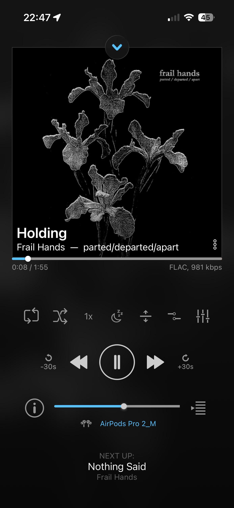
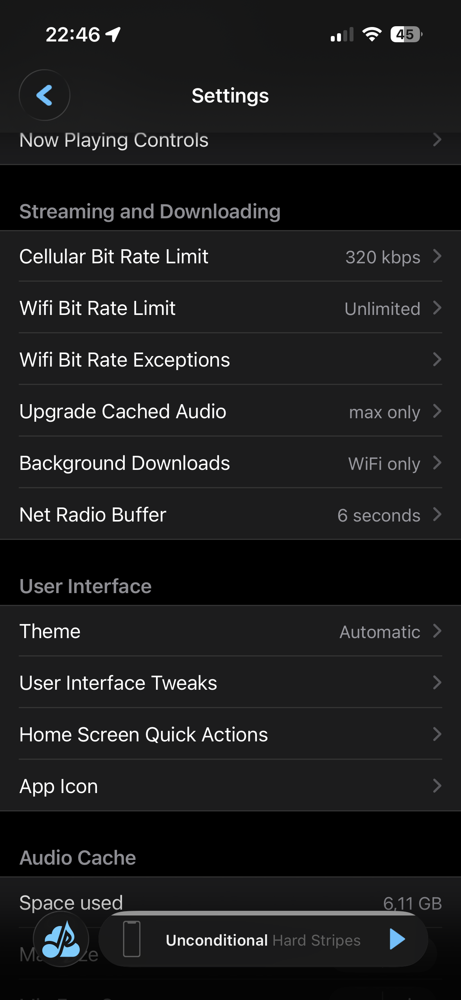
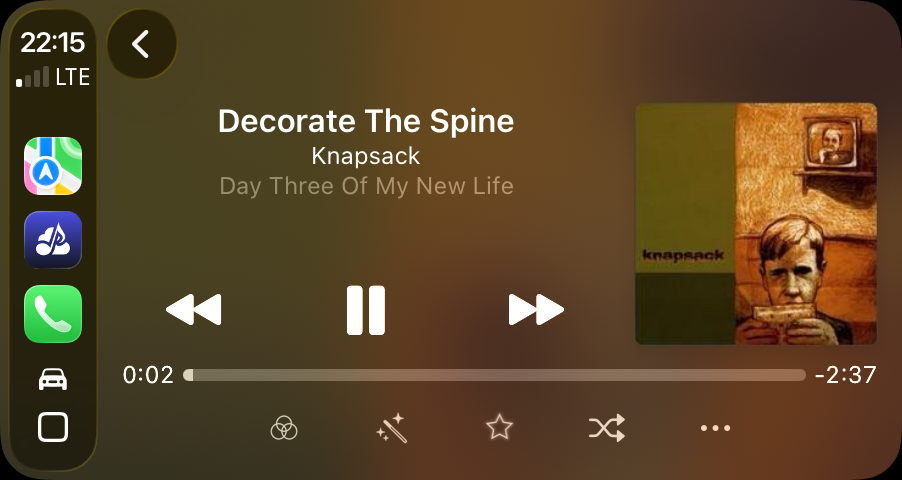
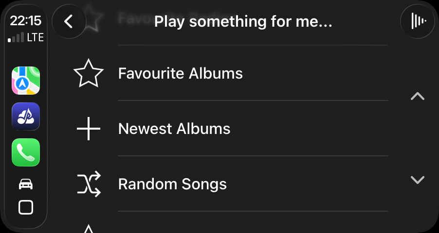

+++
date = '2026-02-21T11:08:12+01:00'
draft = true
title = 'Ultimate(ish) self-hosted Spotify(ish) solution for cheap using Traefik and Navidrome and Apple client devices'
description = "A guide to setting up a self-hosted Spotify or music streaming alternative using Traefik, Navidrome, and Apple client devices. HTTPS, Let's encrypt"
+++

It's pretty much my hobby to trade-in convenience for hassle so I know that's not something everyone will be psyched to setup, but if you:

- have lots of high-quality/old/obscure digital (and to-be-digitalized) music
- your music workflow is based on what you want to listen to rather than letting algorithms decide

then this might be something for you.

## Prerequisites

- **Server**. Linux-based, Small powered ARM SBC like Raspberry Pi or Odroid is plenty powerful for this usecase
- **Storage**. For your music collection (duh), you might want to consider something faster for cover and transcoding cache.
- **Way to reach it from the internet** (setup zerotrust if you're paranoid).
- **Docker**. We're going to use compose since it's the easiest and has the smallest footprint. Consider rootless docker or podman if you're planning to expose it to the internet.
- **Domain name**. This will ensure automatic TLS certificate management from traefik. If you don't want to do that, you can skip the parts related to cert

## Docker setup
We're doing simple docker compose file (try rootless docker or podman to avoid running as root)

```
services:
    reverse-proxy:
        image: traefik:v2.4
        restart: unless-stopped
        ports:
            - "80:80"
            - "443:443"
            - "8080:8080"
        volumes:
            - /opt/stack/traefik/traefik.yml:/etc/traefik/traefik.yml
            - /opt/stack/traefik/acme:/acme
            - /var/run/docker.sock:/var/run/docker.sock
    navidrome:
        image: deluan/navidrome:0.59.0
        environment:
            ND_SCANINTERVAL: 10m
            ND_LOGLEVEL: info
            ND_BASEURL: ""
            ND_ENABLETRANSCODINGCONFIG: "true"
            ND_TRANSCODINGCACHESIZE: "1024MB"
        volumes:
            - "/opt/stack/navidrome/data:/data"
            - "/sd/navidrome_transcoding:/data/cache/transcoding"
            - "/sd/navidrome_images:/data/cache/images"
            - "/multimedia/music/a_sorted:/music:ro"
        restart: unless-stopped
        labels:
            - "traefik.http.routers.navidrome.rule=Host(`music.example.com`)"
            - traefik.http.routers.navidrome.tls=true
            - traefik.http.routers.navidrome.tls.certresolver=myresolver
```


## Clients

The best part about using Subsonic-based solution is the access you get to plethora of great client applications on mobile and desktop, regardless of your ecosystem. Today we're going to focus on iOS/MacOS/tvOS and CarPlay.

### PlaySub (iOS/CarPlay)
play:Sub is one of the best clients for Navidrome/Subsonic in existence. I can't believe it's free and seemingly created by a single developer - Michael Hansen. Sure, I'd love if Michael followed Human Interface Guidelines from Apple to the letter so that the app felt a bit more "native-y", but he's already damn close. 

The app integrates with navidrome seemlessly, and the whole setup could be reduced to providing hostname, username and password. The interface is pretty obvious, with a lot of customization from different forms of randomization/playling latest uploads to powerful equalization.



The app is definitely made by someone who understands the pains of searching for an artist or album in a vast library - there are convenient gestures to quickly reach a particular letter and multiple filters to get specific set of albums even if your tagging is subpar... There's a lot of less prominent niceties, like different transcoding (or lack there of) expecations depending on the connectivity i.e. Wi-Fi vs. data. I've configured play:SUB to feed me FLAC on Wi-Fi (which is great at home but tends to be painful in public places), and otherwise fall back to near-transparent Opus (the 320 is to cover MP3 given that Opus is almost transparent at 96).



If that wasn't enough to instantly become a fan, Michael ensured there's Carplay integration (watchOS AFAIR too), making this the ultimate player for every scenario (except tvOS which we'll get to)



Similarily to mobile interface, CarPlay gives you convenient ways to quickly shuffle your library, get newer albums etc. which is quite nifty for avoiding car crashes (screenshots were made in the parking lot!)



### Amperify (macOS)

### ostui/stmps (cross-platform - CLI, TUI/curses interfaces)
To nerd it out like a pro, you can leverage one of the nice
