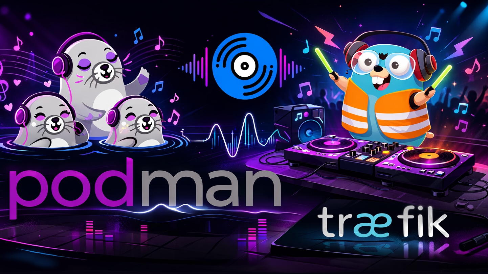
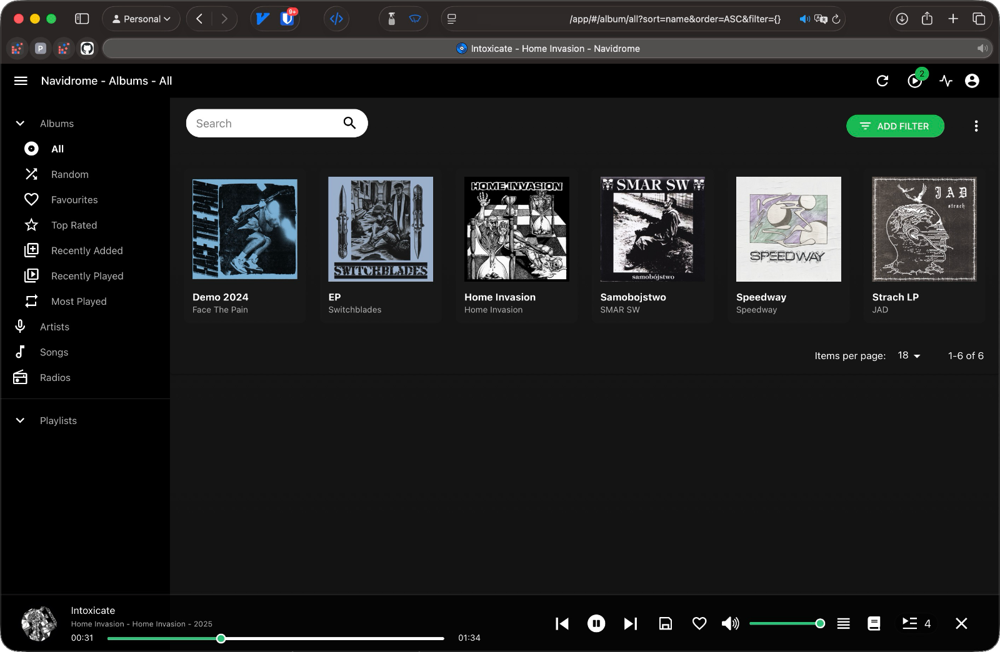
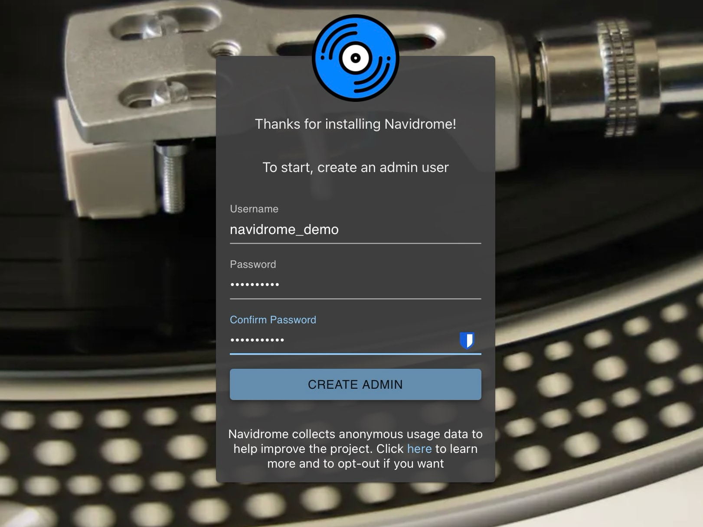
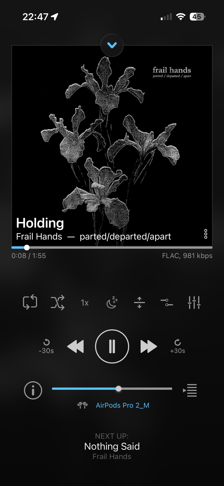
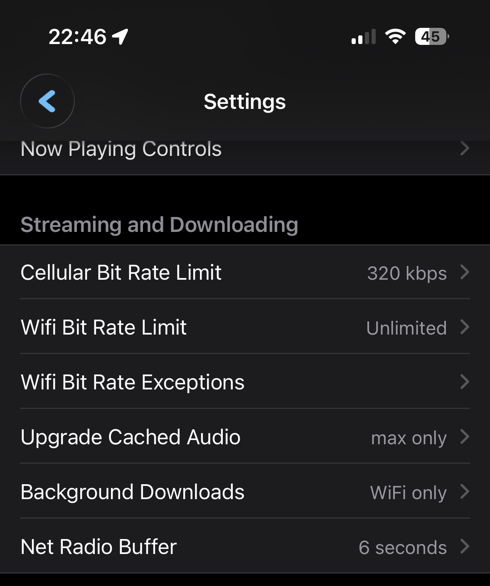
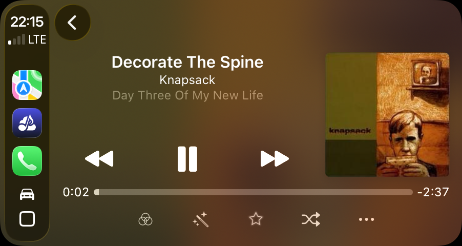
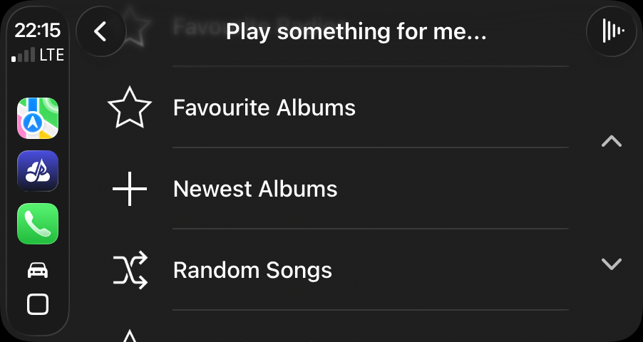
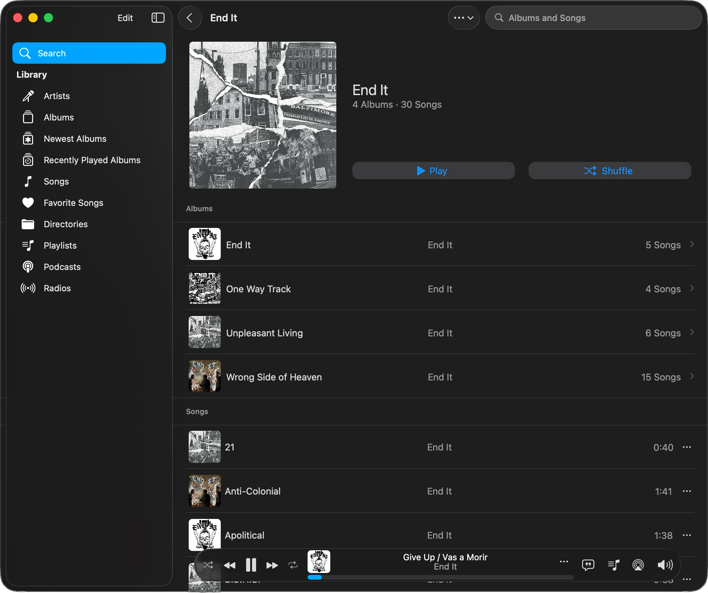
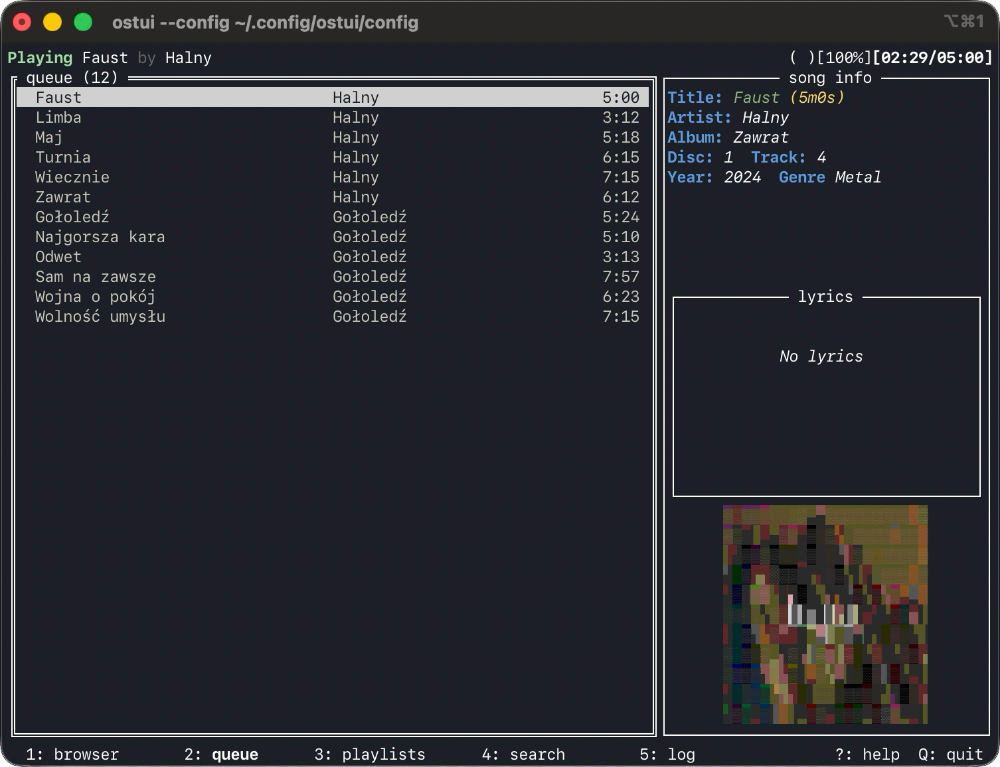
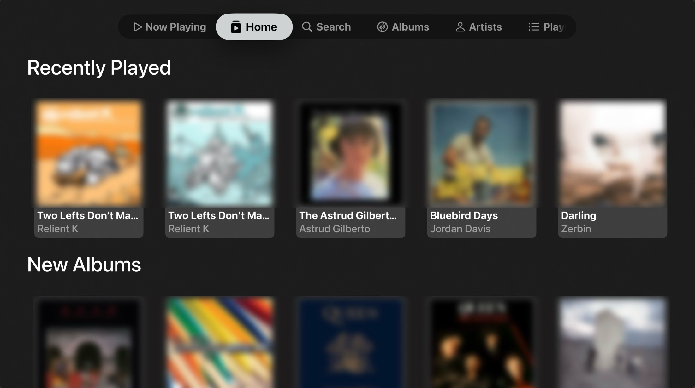

+++
date = '2026-02-21T11:08:12+01:00'
draft = false
title = 'Ultimate(ish) self-hosted Spotify(ish) solution for cheap using Docker/Podman, Traefik, Navidrome and Apple client devices'
description = "A guide to setting up a self-hosted Spotify or music streaming alternative using Docker/Podman, Traefik, Navidrome, and Apple client devices. HTTPS, Let's Encrypt."
+++



It's pretty much my hobby to trade-in convenience for hassle so I know that's not something everyone will be psyched to setup, but if you:

- have lots of high-quality/old/obscure digital (and to-be-digitalized) music
- your music workflow is based on what you want to listen to rather than letting algorithms decide

then this might be something for you.

## Navidrome

[Navidrome](https://navidrome.org/) is a self-hosted music streaming server that is compatible with so called Subsonic-API. Subsonic used to be the de-facto standard for personal self-hosted music streaming, but has been abandoned as FOSS project and in an effort to make it profitable, turned into a proprietary service. 



The Subsonic API however is still open and multiple forks followed (e.g. Arisonic), including completely new software written from scratch, like Navidrome, which still adheres to Subsonic API for client consumption. This means you can run a small-footprint, fast, modern looking streaming server on a Raspberry Pi 4-grade machine (i.e. any low-powered ARM SBC) and connect to it from your phone, desktop, home media center, car and whatnot.


## Prerequisites

- **Server**. Linux-based, Small powered ARM SBC like Raspberry Pi or Odroid is plenty powerful for this usecase
- **Storage**. For your music collection (duh), you might want to consider something faster for cover and transcoding cache.
- **Way to reach it from the internet** (setup zerotrust if you're paranoid).
- **Docker/Podman**. We're going to use compose since it's the easiest and has the smallest footprint. Consider rootless docker or podman if you're planning to expose it to the internet.
- **Domain name**. This will ensure automatic TLS certificate management from traefik. If you don't want to do that, you can skip the parts related to cert

## Installation (via Podman/Docker)
We're doing simple docker/podman compose file. I'm using Podman and podman compose for this example (and for my standard setup) to avoid running as root. I'll put comments where SELinux or other quirks come up.

### Traefik

If you don't know [**traefik**](https://doc.traefik.io) yet, it's a lightweight solution for container discovery, routing and load balancing. It's *smart* by default, has in-built support for HTTPS via Let's Encrypt and handles configuration via docker labels, making it a pretty much one-file deployment. You could just as well run Nginx/HAproxy/Apache/Caddy or whatever you fancy. Caddy also makes it easy to setup a reverse proxy with automated TLS certificate management and HTTPS by default.

### {docker|podman}-compose.yml

```yaml
services:
  traefik:
    image: "traefik:v3.5"
    container_name: "traefik"
    security_opt:
       # that's SELinux domain, you can skip it with Docker FWIW
      - "label=type:container_runtime_t"
    command:
      - "--providers.docker=true"
      - "--providers.docker.exposedByDefault=false"
      - "--entryPoints.websecure.address=:443"
      - "--certificatesresolvers.myresolver.acme.tlschallenge=true"
      
      # make sure you provide a valid email address
      - "--certificatesresolvers.myresolver.acme.email=mail@example.com"
      - "--certificatesresolvers.myresolver.acme.storage=/acme.json"
    ports:
      - target: 80
        published: 80
        mode: host
      - target: 443
        published: 443
        mode: host
    volumes:
      # mount acme.json for Let's Encrypt
      - /home/demouser/acme/acme.json:/acme.json:z
      
      # socker mapped for rootless runtime. If you don't care and you use docker with root
      # you're good with /var/run/docker.sock:/var/run/docker.sock:ro
      - /run/user/1000/podman/podman.sock:/var/run/docker.sock:ro

  navidrome:
    image: "deluan/navidrome:latest"
    restart: unless-stopped
    environment:
      ND_TRANSCODINGCACHESIZE: "1024MB"
      ND_ENABLETRANSCODINGCONFIG: "true"
    volumes:
      # you can put cover cache and transcoding cache
      # on a faster drive if you have one
      
      - "/opt/navidrome/data:/data"
      - "/opt/cache/navidrome_transcoding:/data/cache/transcoding"
      - "/opt/cache/navidrome_images:/data/cache/images"
      - "/opt/music:/music:ro"
    labels:
      - "traefik.enable=true"
      - "traefik.http.routers.navidrome.rule=Host(`music.example.com`)"
      - "traefik.http.routers.navidrome.entrypoints=websecure"
      - "traefik.http.routers.navidrome.tls=true"
```

That's it. As long as you have a resolvable domain name (`music.example.com` in our case), that's the whole setup. Your server will require first-time user setup before it starts indexing your music library. Bear in mind transcoding is using ffmpeg, don't get too crazy with transcoding settings on an underpowered device.



## Clients

The best part about using Subsonic-based servers is the access you get to plethora of great client applications on mobile as well as desktop, regardless of your ecosystem. Today we're going to focus on iOS/MacOS/tvOS and CarPlay and my recommendations for seemless workflow.

### PlaySub (iOS/CarPlay)
play:Sub is by far my favorite client for Navidrome/Subsonic. I still can't fathom it's free and, apparently, created by a single developer - Michael Hansen. Sure, I'd love if Michael followed Apple's Human Interface Guidelines to the letter so that the app felt a bit more "native-y", but he's already damn close.

The app integrates with Navidrome without any setup quirks so it's pretty much reduced to providing hostname, username and password. The interface is pretty obvious, with some customization options available - from different forms of randomization/playing latest uploads to powerful equalization.



The app was definitely made by someone who understands the pains of searching for an artist or album in a vast library - there are convenient gestures to quickly reach a particular letter and multiple filters to get specific set of albums even if your tagging is subpar to say the lease... There's a lot of less prominently displayed niceties, like different transcoding profiles depending on the connectivity established,i.e. Wi-Fi vs. data. I've configured play:SUB to feed me FLAC on Wi-Fi (which is great at home but tends to be painful in public places), and otherwise fall back to near-transparent Opus (the 320 is to cover MP3 in the library given that Opus is almost transparent at 96 AFAIR).



If that wasn't enough to instantly become a fan, Michael ensured there's Carplay integration (watchOS AFAIR too), making this the ultimate player for every scenario (except tvOS which we'll get to).



Similarily to mobile interface, CarPlay gives you convenient ways to quickly shuffle your library, get newer albums etc. which is quite nifty for avoiding car crashes (screenshots were made in the parking lot!)



### Amperify (macOS)
Amperify is a nice-looking, fresh and well-maintained client for both macOS and iOS. It falls short compared to play:Sub on iOS in my opinion, but it feels native on desktop and supports the new interface design elements that come with **ATROCIOUS** Tahoe. 



### ostui/stmps (cross-platform - CLI, TUI/curses interfaces)
To nerd it out like a pro, you can leverage one of the nice TUI/curses-based interfaces. [ostui](https://git.sr.ht/~ser/ostui)/[stmps](https://github.com/spezifisch/stmps) are both forks of [stmp](https://github.com/wildeyedskies/stmp), but ostui is more actively maintained and has more features.



To install ostui on macOS, you have to compile it and provide paths to libmpv which on macOS is a bit more complex than just installing libmpv-dev package. This assumes you already have `go` on your system. It obviously works out of the box on Linux...

1. Install mpv (non-cask version) via Homebrew:
   ```
   brew install mpv
   ```
2. Clone the ostui repository:
   ```
   git clone https://git.sr.ht/~ser/ostui
   cd ostui
   ```
3. Compile ostui (make sure you provide the correct paths to mpv's lib and include directories for both flags respectively):
   ```
   CGO_LDFLAGS="-L/opt/homebrew/Cellar/mpv/0.41.0_2/lib" CGO_CFLAGS="-I/opt/homebrew/Cellar/mpv/0.41.0_2/include" go build -v .
   ```
4. Install ostui:
   ```
   sudo mv ostui /usr/local/bin/
   chmod 755 /usr/local/bin/ostui
   ```
5. Configure ostui [as per instructions](https://git.sr.ht/~ser/ostui#configuration). Bear in mind $HOME/.config/ostui/config location does not work on macOS

## Subswift (tvOS)

Subswift is a Navidrome (not sure if fully, but at least partially subsonic-compatible) client for tvOS. It's paid and works pretty okay. It lacks a ton in terms of queuing so it might feel a bit subpar if you're looking to shuffle your music. It's good enough for someone's pet project and with how poor tvOS app ecosystem is it's still woth a try.


